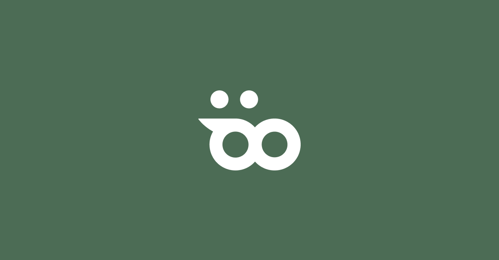

# 

### 🏘 소개

효율적인 팀 프로젝트를 위한 협업 툴, **협업돼지** 입니다.

 

 

 

 

 

 

 

### 🏃🏻‍♂️ 멤버 구성 (총 8명)

- Front-end : 예상기, 안지현, 김아영
- Back-end : 이현수, 명재국, 김동현
- Designer : 안나, 정서윤

### ⏰ 개발 기간

2021.07.23 ~ 2021.09.02 (6주)

### 📝 프론트엔드 개요

- 개발 언어 : Javascript
- 개발 라이브러리 : React.js
- 형상 관리 : git
- 협업 툴 : notion
- 디자인 공유 : Figma

 

## 🛠 프로젝트 구조

 

## 🔧주요 기능
<a href="https://github.com/team-pig/pig-frontend/wiki/%E2%9C%A8-%EA%B8%B0%EB%8A%A5-%EC%86%8C%EA%B0%9C">자세한 기능 소개 바로가기 - Wiki</a>

1. 방 : 각 팀 프로젝트 마다 방을 생성하여 별개의 여러 프로젝트들을 각각 관리, 사용할 수 있습니다.

2. 대시보드 : 프로젝트 구성원들의 업무 현황, 방 정보, 내 할 일을 볼 수 있습니다.

3. 문서 : 문서를 작성, 편집, 공유할 수 있습니다. 마크다운 에디터로 구성되어 있습니다.

4. 보드 : 칸반 보드를 통해 할 일을 효율적으로 관리할 수 있습니다. 칸반 보드는 버킷 > 카드 > 투두로 세분화됩니다.

5. 일정 : 캘린더 형태로 할 일을 볼 수 있습니다. 보드와 데이터가 연동되도록 구성되어 있어 일관적인 일정을 구성할 수 있습니다.

 

## 🐷프로젝트 특징

### 배포

- Client : AWS Amplify
- Server : AWS EC2

### 반응형 웹

: 유틸리티 서비스 특성 상 유저가 어떤 기기에서도 정보를 확인할 수 있고, 최대한 편집이 가능하도록 반응형 웹을 구현했습니다.

### 튜토리얼
: 처음 서비스를 사용하는 유저를 위해 페이지마다 튜토리얼을 제공하고 있습니다.  
 현재는 최초 사용자에게만 안내하고 있지만, 추후 각 페이지에서 '도움'버튼을 통해 튜토리얼을 제공할 수 있도록 업데이트 예정입니다.
 

### 다양한 패키지를 적재적소에 사용

| 패키지 | 목적 |
|--|--|
| React-beautiful-dnd | [보드] Drag and Drop 구현을 위해 사용 |
| React-joyride | [공통] 유저 튜토리얼 구현을 위해 사용|
| React-rnd | [문서] 문서 페이지 Aside user custom UI 구현을 위해 사용|
| React-tooltip | [공통] tooltip 구현을 위해 사용 |
| React-helmet | [공통] html head의 meta, title tag 핸들링을 위해 사용 |
| React-datepicker | [공통] 커스텀 input(date) 구현을 위해 사용 |
| Toast-UI-editor | [문서] 페이지의 텍스트 에디터 구현을 위해 사용 |
| Emoji-picker-react | [채팅] 이모지 입력 기능을 위해 사용 |
| Formik | [공통] input validation을 위해 사용|
| Universal-cookie | [공통] 손쉬운 쿠키 핸들링 위해 사용|

 

